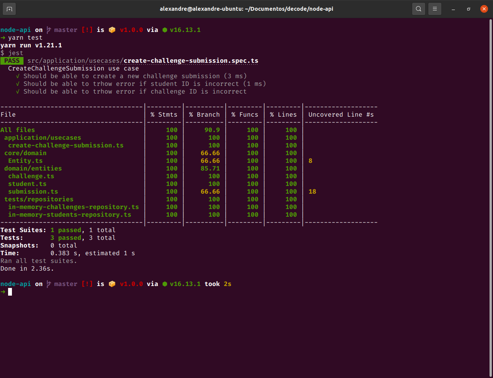

> # Mini API Node.js escalável com SOLID e TDD

<p align="center">
  
</p>

> Você pode clonar este repositório com algum dos seguintes commandos:

```bash
# SSH
git clone git@github.com:alexandresantosm/node-api.git

# HTTPS
git clone https://github.com/alexandresantosm/node-api.git

# GitHub CLI
gh repo clone alexandresantosm/node-api
```

> Instalar as dependèncias necessárias:

```bash
# Entrar na pasta do projeto
cd node-api

# YARN
yarn

# NPM
npm install
```

> ## 🧪 Tecnologias

A API desenvolvida utiliza as seguintes tecnologias:

- [NodeJS](https://nodejs.org/pt-br/)
- [TypeScript](https://www.typescriptlang.org)
- [Jest](https://jestjs.io/pt-BR/)
- [SWC](https://swc.rs/)

---

Build with 💜 by Alexandre 👋🏻.
